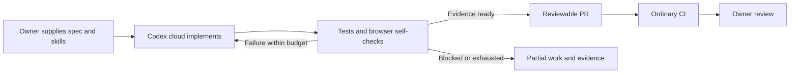
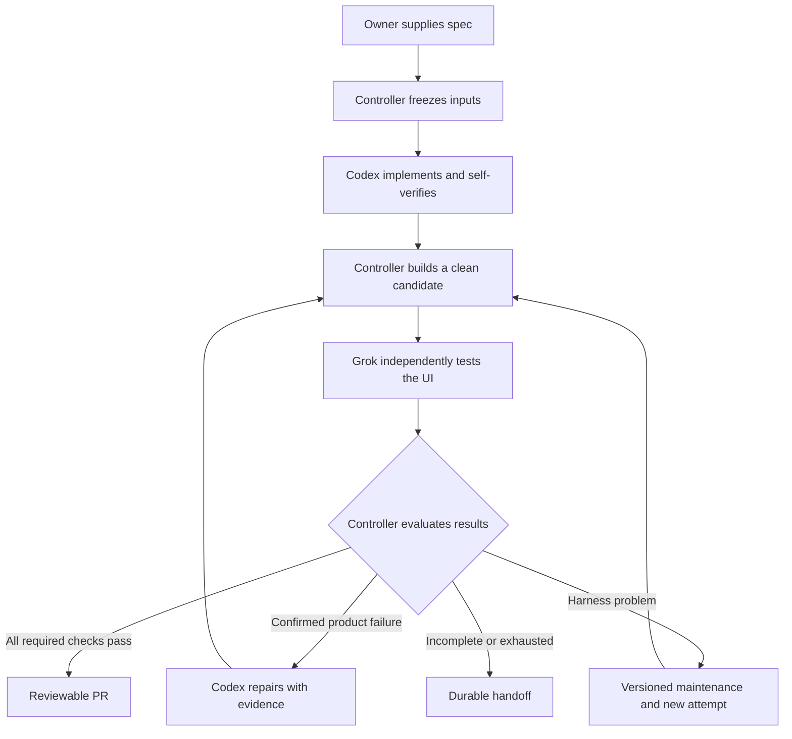

# Cloud agent workflow: implementation plan

Updated: 2026-09-07. Owner: `cmsart`.

This document preserves the architecture discussion and recommended implementation sequence so a future project can adopt it without the original chat. It records intended behavior, not an implemented cloud service. Use the [project handoff](PROJECT_HANDOFF.md) to resume work around a real repository.

## Purpose and present state

Increase project velocity by giving agents dependable ways to implement, check, and independently validate web application changes. Autonomy should grow as the verification system demonstrates that it catches defects and handles incomplete evidence correctly.

**V1 uses managed Codex cloud agents with our skills for implementation, automated tests, and browser self-validation.** Ordinary CI reruns required checks and the owner reviews the result. Start with one implementation owner per feature. Judge the need for an external validator from missed defects, review effort, and cost observed on real tasks.

The earlier E2B/GitHub Actions controller and independent **xAI Grok** validator design is retained below as a deferred option. It is not a v1 prerequisite. A second independent GPT validator is a further experiment only if the first validator demonstrates useful incremental detection.

Completed:

- Forked `cursor/plugins` to [cmsart/pstack](https://github.com/cmsart/pstack).
- Added six adapted skills, a shared runtime contract, source provenance, license attribution, and reading examples under `agent-workflows/`.
- Preserved the original `pstack/` tree for comparison.
- Checked skill structure, local Markdown links, pinned source hashes, and example criterion IDs. These were static checks only.

Not completed:

- Selection or onboarding of the first product repository.
- A project-specific operating guide and exercised verification helpers.
- A configured and exercised Codex cloud project environment or cloud agent runs.
- A browser adapter, Grok validator program, evidence storage, executable acceptance gate, or controller.
- GitHub Actions integration for this architecture, automatic repairs, or live evaluations.

The local library is not globally installed. Its original implementation commit is `bd7d529754885780eb230576ed81966562f6c6f8`; future runs must pin the library version they actually use.

## Document ownership

| Document | Owns |
| --- | --- |
| This plan | Motivation, architecture explanation, sequencing, open choices, and integration milestones |
| [Runtime contract](RUNTIME_CONTRACT.md) | V1 self-validation requirements and the deferred independent-validation contract |
| [Six skills](README.md) | Instructions for agents carrying out each phase |
| [Project handoff](PROJECT_HANDOFF.md) | How to apply this plan to a new project and retain its progress |
| [Upstream comparison](UPSTREAM_COMPARISON.md) and [provenance](provenance.json) | Source correspondence and attribution |

Use the runtime contract's v1 scope for the first project; its independent-validation schemas and controller requirements apply only if that later mode is selected. Keep completed history distinct from future proposals.

## Direction and implementation choices

| Topic | Direction from the discussion | Status |
| --- | --- | --- |
| First product | A web app with a backend and browser frontend in a `cmsart` repository | Exact repository and stack not selected |
| Implementer | Managed Codex cloud implements, runs useful automated checks, and drives the UI using our skills | Selected v1 |
| Independent validator | If justified, xAI Grok derives browser journeys from the spec, without source or builder conclusions | Deferred; evaluate need after v1 |
| Model versions | User originally proposed Grok 4.6, potentially 4.7 later; optional GPT-6 validator | Historical preferences; verify available identifiers and capabilities at integration |
| Hosting | Managed Codex cloud environment; E2B only for a later custom component if needed | Selected v1; not configured |
| Orchestration | Manually submit Codex cloud tasks; use ordinary repository CI | Custom controller and agent-orchestration Actions deferred |
| Sequencing | Start product interactively, prove verification, run managed Codex cloud, evaluate observed gaps | Current agreed direction |
| Containers | Reuse Compose if it works; ordinary processes are also viable | Choose based on the actual project |
| Publication | Produce a reviewable branch/PR; merge and deployment follow explicit project policy | Exact permissions remain to be configured |
| Extra validators | Add only when evaluations show useful incremental detection | Deferred |

## Build the product before the general framework

Start interactively and complete one meaningful feature across frontend, backend, and persisted state. Include authentication if it is central to the product. Add ordinary build/test CI during this work. There is no need to wait for a mature application.

Use the bootstrap and implementation skills while building. Turn working environment procedures into executable helpers and a concise operating guide. Documentation should record instructions that were exercised, with untested portions labeled.

The threshold for the first cloud integration is:

> A fresh environment can start the application, provision disposable test data, execute one real browser journey, and retain its evidence using documented commands.

Managed Codex implementation and self-validation is the first cloud capability to exercise. Install and test the browser dependencies and application services in the actual cloud environment. Browser automation through a tool such as Playwright is the proposed route; equivalent native desktop Browser tools or screenshot perception have not been verified for cloud coding tasks. Record the capabilities actually available rather than assuming them.

Continue interactive product development as useful. Add an independent validator only when a bounded pilot is justified by observed gaps; a custom controller is a separate decision, not an automatic next step.

## V1: one feature from request to review

1. Write the feature spec in the project, with required observable outcomes and stable criterion IDs where useful.
2. Manually submit a Codex cloud task against the intended repository and branch. Supply the spec, scope, project operating guide, pinned library revision, and implementation skill explicitly. The task does not inherit this planning conversation.
3. Let environment setup install the project and browser dependencies. The task starts frontend/backend services, prepares disposable data, and checks readiness using exercised project commands.
4. Codex implements the change, runs relevant unit/integration checks and required repository checks, and drives the changed behavior through the real browser. It records outcomes for each required criterion, including reload/session checks where needed.
5. Codex repairs failures within the stated task budget and preserves failing and passing evidence. Report missing browser capabilities or incomplete coverage explicitly. Export work and artifacts through a verified durable path before the environment is discarded.
6. Produce a reviewable branch/PR under the task's publication permissions. Ordinary CI reruns the required checks against the submitted commit. The owner reviews the spec coverage, diff, evidence, and remaining gaps before merge under project policy.

This is self-validation. CI is a separate execution of checks, not an independent semantic validator. Passing results do not by themselves grant merge or deployment authority. The full controller receipt schema and isolated acceptance environment below are not required for this v1.

## Deferred architecture: independent validation

The remaining controller/E2B design preserves the earlier discussion for a possible later pilot. Activate it deliberately after evaluating v1; do not build it as part of initial project onboarding.

### What runs where if independent validation is added

An agent combines model inference, a program managing the conversation/tool loop, and executable tools. The model remains hosted by its provider; E2B hosts the programs, application processes, browser, and files.

| Component | Proposed location | Responsibility |
| --- | --- | --- |
| Controller | GitHub Actions runner initially | Freeze inputs, launch phases, enforce limits, collect outputs, decide next state, publish authorized results |
| Implementation environment | E2B sandbox A | Editable source, Codex CLI, development services, tests, browser self-checks |
| Candidate application | Clean E2B sandbox B | Build from committed content; run frontend/backend and isolated data; stay fixed during validation |
| Validator environment | E2B sandbox C | Trusted Grok loop and browser adapter; exposes only approved tools to the model |
| Models | OpenAI and xAI services | Reason about prompts and observations, request tool calls, produce reports |
| Durable artifacts | Storage outside disposable sandboxes | Preserve task manifests, commits/patches, reports, logs, traces, and screenshots |

These are separation boundaries, not a requirement to keep three sandboxes running permanently. A phase can end after its outputs are safely externalized. Start with one bounded controller process per task; a permanent orchestration service is not an MVP requirement.

The controller and enforcement tools must come from trusted pinned inputs. Candidate changes to their apparent configuration must not alter the rules of the current run. Likewise, a read-only library mount only provides protection if the worker cannot override that restriction; enforce the boundary in runtime permissions.

### A future controller-managed feature from request to result

1. **Specify behavior.** The owner writes a feature spec with stable required criterion IDs, preconditions, and observable outcomes. Normal prose can accompany structured fields. Optional ideas stay separate. The [notes example](examples/notes-acceptance.json) illustrates creation, persistence, invalid input, and cross-user isolation.
2. **Trigger a task.** Initially use a manual workflow dispatch with a spec path and base reference. A local/manual launcher is enough while developing the integration. An authorized issue label can be added later; snapshot the issue contents when starting the task.
3. **Freeze inputs.** Resolve the base reference to a commit and record exact spec bytes/hash, skill and harness revisions, template/tool versions, task ID, scope, and limits. Product requirement changes create a new spec version rather than editing the acceptance target mid-run.
4. **Prepare the implementer.** Start sandbox A, supply the source and complete role brief, load the selected skill and contract, inject required credentials, and connect real shell/file/browser tools. A fresh invocation does not inherit the planning chat.
5. **Implement and self-check.** Codex changes the product, adds meaningful tests, runs required checks, drives the changed journey, and observes outcomes such as persistence after reload. It exports committed changes and evidence through the controller's handoff path.
6. **Create the candidate.** Build from committed content in fresh sandbox B using pinned dependencies/configuration. Run migrations and required checks, provision disposable data, verify readiness, and bind a controller-owned build ID to the tested content. A mutable development server is not an independent candidate.
7. **Prepare independent validation.** Start a fresh Grok context and isolated browser/server-side fixtures. Supply the frozen spec, candidate identity/URL, operating guide, validator skill, permitted tools, and budget. Withhold source, feature recipes, implementation narrative, self-check results, and other initial validator findings.
8. **Exercise the real UI.** Grok chooses journeys from the requirements. The adapter executes approved actions, captures observations, and records evidence. Browser requests naturally exercise frontend, backend, and database; direct business-API shortcuts do not establish that the UI path works.
9. **Evaluate results.** Require one result per criterion, valid evidence references, matching identities, and all required automated checks. Apply the runtime contract's accept/repair/replay/block rules. The model's process exit or positive summary alone never means acceptance.
10. **Repair when justified.** A confirmed defect returns to Codex with reproduction and evidence. A new commit means a new candidate and full required acceptance coverage. Harness failures go to separate maintenance; ambiguous requirements go to the owner.
11. **Publish and clean up.** Create/update the authorized branch/PR and retain results and partial work, including on failure. Export evidence before teardown and configure cleanup/expiry for abandoned resources. Merge and deployment follow project policy. Changes after validation require fresh relevant acceptance for the changed identity.

## Skills, tools, and application setup

For v1, make the pinned package available inside the Codex cloud checkout or setup environment and keep `agent-workflows/` intact. Point the project instructions and task brief to the relevant skill and the v1 runtime scope. Exercise this loading path in the first task. Native discovery can be configured after checking the actual cloud surface; a plugin installed on the local desktop is not proof that its files exist in cloud tasks.

Use bootstrap, implementation, maintenance, and improvement as needed. The repair skill also handles failures found by self-checks, CI, or human review. Keep `validate-ui-acceptance` available for later; it is not a required v1 stage. Skills cannot enforce a CI gate or create missing tools.

The custom runner details in the next four paragraphs apply only to the deferred independent-validation mode:

E2B does not register skills. A skill is an instruction package; the agent runner decides how to load it. Fetch the pinned `agent-workflows/` package intact because its entrypoints reference shared resources. For mandatory phases, explicitly supply the selected skill and runtime contract in the agent's initial instructions.

Codex has native local skill discovery; registration can point to the intact installed package. Verify the supported paths and link behavior against the CLI version chosen for the integration. Do not copy one skill folder and silently break its references. A global plugin installation is not required for the pipeline.

For Grok, the proposed custom validator program reads the relevant files and supplies their contents as instructions. It defines allowed tools, receives model tool requests, executes them, records the outcome, returns observations, and repeats until report submission or budget exhaustion. This provides the behavior we need without assuming a particular Grok CLI or native skill loader.

The browser adapter supplies actual navigation, clicks, typing, keys, scrolling, screenshots, visible/accessibility observations, bounded waits, and approved fixture operations. Codex can use an MCP interface; Grok can use function definitions backed by the same capabilities. Exact implementation and tool names are open. No prompt can create missing tools.

Use both useful scripted E2E tests and agent-selected journeys. Scripts provide repeatable regressions; independent exploration tests whether a fresh agent can establish the requested behavior without copying the builder's test recipe. Preserve traces and screenshots from the first attempt, not only successful retries.

Neither application service must be containerized. Reuse a working Compose setup when available; otherwise run normal processes in the sandbox. Use the project's real database engine where relevant rather than introducing a substitute that hides meaningful behavior. Managed services need disposable test resources or explicitly documented test doubles. A test double does not establish production integration behavior.

For a simple app, one browser-facing origin can serve the frontend and proxy API requests to the backend. Alternatively configure separate origins correctly, including cookies, CORS, and authentication callbacks. The bootstrap must exercise the selected arrangement. Restrict candidate URL access as appropriate; runtime code manages access credentials.

Fresh cookies do not isolate server data. Use dedicated fixtures/namespaces with enforced isolation, or separate databases/app instances for each validator. Keep model-provider and repository-write credentials out of the candidate application environment.

## Deferred acceptance, evidence, and limits

The [runtime contract](RUNTIME_CONTRACT.md) is authoritative for exact fields and rules. Its essential properties are:

- Every required criterion receives `PASS`, `FAIL`, `BLOCKED`, or `INCONCLUSIVE`. Missing, duplicate, stale, malformed, or unsubstantiated coverage is not a pass.
- Trusted tools capture artifacts and issue receipts bound to attempt and candidate identity. Agents reference evidence; they cannot manufacture authoritative receipts.
- The controller checks report structure, identities, artifact existence, and automated check results. These checks cannot mechanically prove every semantic product judgment; validator quality needs empirical evaluation.
- A single reproduced required-behavior failure prevents acceptance. Additional validators do not vote a counterexample away. A missing required validator does not silently reduce the required count.
- Preserve intermittent failures and replay history. Defaults are at most two product repair rounds per task and one infrastructure replay per failed attempt, also bounded by explicit task-wide time, usage, and tool-call limits.
- A new candidate, build/configuration, spec, skill, or harness revision requires a new acceptance attempt. Active runs do not hot-edit their own rules.
- Evidence, patches, and reports survive sandbox cleanup. Retries receive unique identities and do not overwrite earlier artifacts.

The validator sees app content as data. Tool capabilities must prevent general shell access, source inspection, arbitrary JavaScript/internal-state manipulation, or direct API shortcuts. Use runtime restrictions, not instructions alone, to maintain that boundary.

## Authentication and costs

V1 uses the managed Codex cloud account and its applicable plan limits. It does not require us to distribute Codex credentials into an E2B worker. Verify current account access and record usage where available; cloud setup, browser support, and evidence export still need a real integration test. CI, application test services, and artifact storage may have their own costs.

The following credential and billing choices are retained for a later custom runner, not required for v1:

Earlier documentation research established a headless Codex path using saved ChatGPT-managed authentication for trusted private automation, with usage governed by that account's Codex limits, and a separate API-authenticated path billed through the API account. API authentication is operationally simpler; choosing it does not change the architecture. ChatGPT-managed automation needs secure handling and persistence of refreshed authentication, not a token baked into a reusable image.

Treat this as a dated integration finding, not a permanent pricing or entitlement guarantee. Recheck official guidance, account eligibility, repository trust/visibility, credential refresh, and concurrency before implementing it. Do not copy this chat's auth assumptions into an unattended system without that check.

The proposed custom Grok loop uses xAI API access. E2B compute, GitHub Actions usage, artifact storage, and any external test services are additional resource categories. Record actual provider usage and environment duration; configure available caps and report unavailable accounting explicitly. No prices or budgets have been chosen, and no subscription removes provider rate limits.

## Implementation milestones

| Stage | Build | Evidence needed before advancing |
| --- | --- | --- |
| 1. Interactive product | Real repository and one complete frontend/backend/data feature; ordinary CI | Feature works and useful automated checks pass |
| 2. Reproducible verification | Exercised operating guide, launch/readiness/data/cleanup helpers, browser smoke and artifact export | A fresh checkout/environment follows the guide successfully; evidence survives cleanup |
| 3. Managed Codex cloud v1 | Cloud setup, pinned skills, complete briefs, browser self-checks, evidence handoff, ordinary PR CI and owner review | A real feature is implemented and browser-tested in cloud; failures are repaired or explicitly reported; artifacts survive the task |
| 4. Evaluate v1 | Record outcomes across representative feature tasks; about ten is a suggested first sample | Compare human time per accepted feature, missed defects, false failures, incomplete runs, elapsed time, and usage/cost with interactive work |
| 5. Optional external-validator pilot | Only if justified: fixed candidate, independent xAI Grok browser loop, isolated data, evidence/report checks, bounded launcher | Demonstrate additional defect detection on known-good and deliberately broken cases at acceptable added cost and latency |
| 6. Optional orchestration/generalization | Only if needed: custom controller, E2B workers, agent-orchestration Actions, additional validators | Observed workflow bottlenecks justify each component; another project or measured validator benefit establishes its value |

Basic automated CI belongs in stage 1 and remains part of v1. GitHub Actions for ordinary build/test checks is distinct from building an agent controller. Stage 4 may conclude that no external validator or custom orchestration is needed. If stage 5 is selected, enforce its independence, identity, evidence, and budget boundaries from the start of that pilot.

Evaluate using a known-good app and deliberately broken variants. Extend the [scenario table](examples/acceptance-scenarios.md) into executable cases as the runtime exists. Record misses, false failures, incomplete runs, repeated-run variability, time, and resource usage. Choose numeric quality thresholds with the owner before relying on automatic acceptance; none have been agreed yet.

## Choices to resolve around the first project

| Choice | Starting preference or question |
| --- | --- |
| Product repository | Which repository, stack, baseline, and first feature? |
| Operating environment | Existing launch scripts or Compose? Database, workers, auth, and external services? |
| Cloud environment | Verify managed Codex setup, project dependencies, disposable data, and explicit skill loading |
| Browser implementation | Exercise Playwright or existing tooling in the actual cloud environment; record screenshot/observation capabilities and trace retention |
| Provider access | Codex cloud account access and selected model; defer xAI and custom worker authentication |
| Evidence storage | A verified durable destination for self-check and CI artifacts; trusted controller receipts apply only to the later independent mode |
| Trigger and permissions | Manual first; optional issue trigger later; authorize branch/PR actions explicitly and keep merge/deployment policy separate |
| Budgets | Time, provider usage/spend where measurable, tools, sandbox lifetime, and total concurrency |
| Evaluation | Acceptable misses/false failures and a corpus representing the project's important behavior |

Do not stall initial product work on decisions only needed by later stages. Record reversible assumptions; request an owner decision when ambiguity changes required product behavior.

## Why pstack was adapted this way

We borrowed verification discovery and maintenance, proving work with artifacts, useful regression testing, testing affected callers and assumptions, and turning lessons into structural improvements. We narrowed these ideas to six phases and moved enforcement into the controller contract.

We did not adopt mandatory large agent hierarchies, automatic model fanout/fallback, Cursor-specific invocation conventions, or a majority-vote acceptance rule. V1 focuses on useful implementation self-checks and bounded repair; the independent UI validation design is deferred. The complete file mapping is in [UPSTREAM_COMPARISON.md](UPSTREAM_COMPARISON.md).

Retain original `pstack/` while learning and comparing. The GitHub fork also includes unrelated marketplace plugins because pstack is a subdirectory. Those are not used by our workflow. Periodically review upstream and deliberately port relevant improvements; merging upstream does not automatically update our rewritten skills.

Current provenance checks pin the retained reference snapshot. An upstream sync that changes those files needs an intentional reference/provenance policy update while preserving historical attribution. A future standalone library or separate upstream reference branch remains possible.

Pstack's MIT notice is preserved in [LICENSE](LICENSE). Retaining unused files or GitHub fork status is not a license requirement; retain the applicable copyright and permission notice when carrying substantial portions forward. Do not assume one plugin's license governs all other marketplace content.

## Reference links to recheck during implementation

These official sources informed the discussion on 2026-09-05 through 2026-09-07. Capabilities, auth procedures, model availability, and billing may change; fetch current documentation before integrating.

- [Codex cloud environments and setup](https://learn.chatgpt.com/docs/environments/cloud-environment)
- [Browser capabilities by product surface](https://learn.chatgpt.com/docs/browser)
- [Codex non-interactive execution and automation authentication](https://learn.chatgpt.com/docs/non-interactive-mode)
- [Codex authentication](https://learn.chatgpt.com/docs/auth)
- [Codex skills and discovery](https://learn.chatgpt.com/docs/build-skills)
- [xAI function calling](https://docs.x.ai/developers/tools/function-calling)
- [xAI image input](https://docs.x.ai/developers/model-capabilities/images/understanding)
- [E2B web application example](https://docs.e2b.dev/template/examples/nextjs)
- [E2B Docker and Compose](https://docs.e2b.dev/template/examples/docker)
- [E2B application URLs](https://docs.e2b.dev/network/public-url) and [access restrictions](https://docs.e2b.dev/network/restrict-public-access)
- [E2B with GitHub Actions](https://docs.e2b.dev/use-cases/ci-cd)
- [GitHub workflow triggers](https://docs.github.com/en/actions/how-tos/write-workflows/choose-when-workflows-run/trigger-a-workflow)
- [Playwright traces](https://playwright.dev/docs/trace-viewer-intro)

## Maintaining this plan

Update this document when an architecture decision changes. Update the runtime contract and owning skill when their behavior changes. Record the date, reason, evidence, and affected version. Keep project-specific progress and decisions in the project's own handoff record, using the companion template. Never record credential values.

When resuming, inspect actual repository state before marking a milestone complete. A narrative plan is not evidence of a deployed or tested capability. New tasks need an explicit link or checkout of these documents; they do not automatically inherit this conversation.

| Date | Decision record |
| --- | --- |
| 2026-09-05 | Created the adapted library for one Codex implementer and one independent xAI Grok UI validator, with controller-enforced evidence and bounded repairs. |
| 2026-09-05 | Recommended starting the real product interactively, then independent validation, then automated implementation and orchestration. |
| 2026-09-06 | Persisted the architecture, sequencing, open choices, and future-project handoff. No cloud runtime or product integration was added. |
| 2026-09-07 | Owner selected managed Codex cloud with our skills and self-validation for v1. Ordinary CI and owner review remain; external Grok validation, E2B, and custom orchestration are deferred pending measured need. Updated the plan, handoff, contract scope, and affected skills; no cloud integration was performed. |
