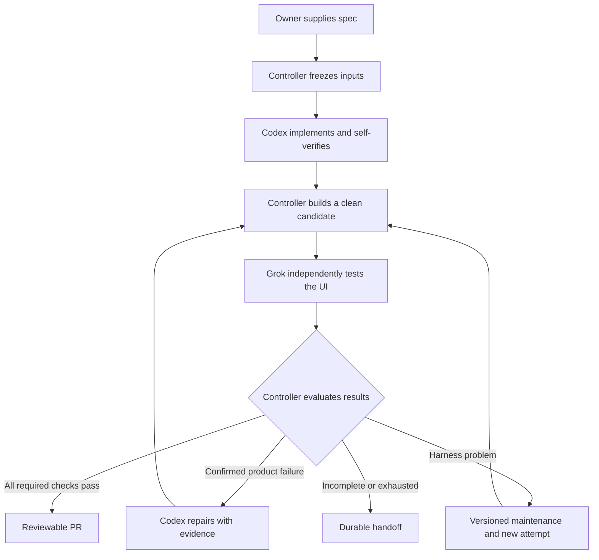

# Cloud agent workflow: implementation plan

Recorded: 2026-09-06. Owner: `cmsart`.

This document preserves the architecture discussion and recommended implementation sequence so a future project can adopt it without the original chat. It records intended behavior, not an implemented cloud service. Use the [project handoff](PROJECT_HANDOFF.md) to resume work around a real repository.

## Purpose and present state

Increase project velocity by giving agents dependable ways to implement, check, and independently validate web application changes. Autonomy should grow as the verification system demonstrates that it catches defects and handles incomplete evidence correctly.

The starting arrangement is one Codex implementer and one independent **xAI Grok** browser validator. The intended cloud environment is E2B, coordinated through GitHub Actions. A second independent GPT validator is an optional later experiment, justified by measured shortcomings of the first validator.

Completed:

- Forked `cursor/plugins` to [cmsart/pstack](https://github.com/cmsart/pstack).
- Added six adapted skills, a shared runtime contract, source provenance, license attribution, and reading examples under `agent-workflows/`.
- Preserved the original `pstack/` tree for comparison.
- Checked skill structure, local Markdown links, pinned source hashes, and example criterion IDs. These were static checks only.

Not completed:

- Selection or onboarding of the first product repository.
- A project-specific operating guide and exercised verification helpers.
- E2B templates, provider authentication integration, or cloud agent runs.
- A browser adapter, Grok validator program, evidence storage, executable acceptance gate, or controller.
- GitHub Actions integration for this architecture, automatic repairs, or live evaluations.

The local library is not globally installed. Its original implementation commit is `bd7d529754885780eb230576ed81966562f6c6f8`; future runs must pin the library version they actually use.

## Document ownership

| Document | Owns |
| --- | --- |
| This plan | Motivation, architecture explanation, sequencing, open choices, and integration milestones |
| [Runtime contract](RUNTIME_CONTRACT.md) | Detailed role boundaries, input/report fields, identities, budgets, and acceptance policy |
| [Six skills](README.md) | Instructions for agents carrying out each phase |
| [Project handoff](PROJECT_HANDOFF.md) | How to apply this plan to a new project and retain its progress |
| [Upstream comparison](UPSTREAM_COMPARISON.md) and [provenance](provenance.json) | Source correspondence and attribution |

Avoid independently redefining report schemas or acceptance rules in project documentation. Implement the runtime contract, and update it deliberately if an authorized design decision changes. Keep completed history distinct from future proposals.

## Direction and implementation choices

| Topic | Direction from the discussion | Status |
| --- | --- | --- |
| First product | A web app with a backend and browser frontend in a `cmsart` repository | Exact repository and stack not selected |
| Implementer | Codex implements, runs useful automated checks, and drives the UI | Selected direction |
| Independent validator | xAI Grok derives browser journeys from the spec, without source or builder conclusions | Selected direction |
| Model versions | User originally proposed Grok 4.6, potentially 4.7 later; optional GPT-6 validator | Historical preferences; verify available identifiers and capabilities at integration |
| Hosting | E2B sandboxes | Intended platform; not integrated |
| Orchestration | A normal controller program invoked by GitHub Actions | Intended design; language and repository location open |
| Sequencing | Start product interactively, prove verification, add independent validation, then automate implementation | Recommended order to carry forward |
| Containers | Reuse Compose if it works; ordinary processes are also viable | Choose based on the actual project |
| Publication | Produce a reviewable branch/PR; merge and deployment follow explicit project policy | Exact permissions remain to be configured |
| Extra validators | Add only when evaluations show useful incremental detection | Deferred |

## Build the product before the general framework

Start interactively and complete one meaningful feature across frontend, backend, and persisted state. Include authentication if it is central to the product. Add ordinary build/test CI during this work. There is no need to wait for a mature application.

Use the bootstrap and implementation skills while building. Turn working environment procedures into executable helpers and a concise operating guide. Documentation should record instructions that were exercised, with untested portions labeled.

The threshold for the first cloud integration is:

> A fresh environment can start the application, provision disposable test data, execute one real browser journey, and retain its evidence using documented commands.

Independent validation is the first cloud capability to build. Keep implementing interactively while testing whether Grok can reliably recognize correct behavior, product defects, and environment problems. Once that works, automate implementation and repairs. Generalize across projects after concrete differences emerge.

## What runs where

An agent combines model inference, a program managing the conversation/tool loop, and executable tools. The model remains hosted by its provider; E2B hosts the programs, application processes, browser, and files.

| Component | Proposed location | Responsibility |
| --- | --- | --- |
| Controller | GitHub Actions runner initially | Freeze inputs, launch phases, enforce limits, collect outputs, decide next state, publish authorized results |
| Implementation environment | E2B sandbox A | Editable source, Codex CLI, development services, tests, browser self-checks |
| Candidate application | Clean E2B sandbox B | Build from committed content; run frontend/backend and isolated data; stay fixed during validation |
| Validator environment | E2B sandbox C | Trusted Grok loop and browser adapter; exposes only approved tools to the model |
| Models | OpenAI and xAI services | Reason about prompts and observations, request tool calls, produce reports |
| Durable artifacts | Storage outside disposable sandboxes | Preserve task manifests, commits/patches, reports, logs, traces, and screenshots |

These are separation boundaries, not a requirement to keep three sandboxes running permanently. A phase can end after its outputs are safely externalized. Start with one bounded controller process per task; a permanent orchestration service is not an MVP requirement.

The controller and enforcement tools must come from trusted pinned inputs. Candidate changes to their apparent configuration must not alter the rules of the current run. Likewise, a read-only library mount only provides protection if the worker cannot override that restriction; enforce the boundary in runtime permissions.

## One feature from request to result

1. **Specify behavior.** The owner writes a feature spec with stable required criterion IDs, preconditions, and observable outcomes. Normal prose can accompany structured fields. Optional ideas stay separate. The [notes example](examples/notes-acceptance.json) illustrates creation, persistence, invalid input, and cross-user isolation.
2. **Trigger a task.** Initially use a manual workflow dispatch with a spec path and base reference. A local/manual launcher is enough while developing the integration. An authorized issue label can be added later; snapshot the issue contents when starting the task.
3. **Freeze inputs.** Resolve the base reference to a commit and record exact spec bytes/hash, skill and harness revisions, template/tool versions, task ID, scope, and limits. Product requirement changes create a new spec version rather than editing the acceptance target mid-run.
4. **Prepare the implementer.** Start sandbox A, supply the source and complete role brief, load the selected skill and contract, inject required credentials, and connect real shell/file/browser tools. A fresh invocation does not inherit the planning chat.
5. **Implement and self-check.** Codex changes the product, adds meaningful tests, runs required checks, drives the changed journey, and observes outcomes such as persistence after reload. It exports committed changes and evidence through the controller's handoff path.
6. **Create the candidate.** Build from committed content in fresh sandbox B using pinned dependencies/configuration. Run migrations and required checks, provision disposable data, verify readiness, and bind a controller-owned build ID to the tested content. A mutable development server is not an independent candidate.
7. **Prepare independent validation.** Start a fresh Grok context and isolated browser/server-side fixtures. Supply the frozen spec, candidate identity/URL, operating guide, validator skill, permitted tools, and budget. Withhold source, feature recipes, implementation narrative, self-check results, and other initial validator findings.
8. **Exercise the real UI.** Grok chooses journeys from the requirements. The adapter executes approved actions, captures observations, and records evidence. Browser requests naturally exercise frontend, backend, and database; direct business-API shortcuts do not establish that the UI path works.
9. **Evaluate results.** Require one result per criterion, valid evidence references, matching identities, and all required automated checks. Apply the runtime contract's accept/repair/replay/block rules. The model's process exit or positive summary alone never means acceptance.
10. **Repair when justified.** A confirmed defect returns to Codex with reproduction and evidence. A new commit means a new candidate and full required acceptance coverage. Harness failures go to separate maintenance; ambiguous requirements go to the owner.
11. **Publish and clean up.** Create/update the authorized branch/PR and retain results and partial work, including on failure. Export evidence before teardown and configure cleanup/expiry for abandoned resources. Merge and deployment follow project policy. Changes after validation require fresh relevant acceptance for the changed identity.

## Skills, tools, and application setup

E2B does not register skills. A skill is an instruction package; the agent runner decides how to load it. Fetch the pinned `agent-workflows/` package intact because its entrypoints reference shared resources. For mandatory phases, explicitly supply the selected skill and runtime contract in the agent's initial instructions.

Codex has native local skill discovery; registration can point to the intact installed package. Verify the supported paths and link behavior against the CLI version chosen for the integration. Do not copy one skill folder and silently break its references. A global plugin installation is not required for the pipeline.

For Grok, the proposed custom validator program reads the relevant files and supplies their contents as instructions. It defines allowed tools, receives model tool requests, executes them, records the outcome, returns observations, and repeats until report submission or budget exhaustion. This provides the behavior we need without assuming a particular Grok CLI or native skill loader.

The browser adapter supplies actual navigation, clicks, typing, keys, scrolling, screenshots, visible/accessibility observations, bounded waits, and approved fixture operations. Codex can use an MCP interface; Grok can use function definitions backed by the same capabilities. Exact implementation and tool names are open. No prompt can create missing tools.

Use both useful scripted E2E tests and agent-selected journeys. Scripts provide repeatable regressions; independent exploration tests whether a fresh agent can establish the requested behavior without copying the builder's test recipe. Preserve traces and screenshots from the first attempt, not only successful retries.

Neither application service must be containerized. Reuse a working Compose setup when available; otherwise run normal processes in the sandbox. Use the project's real database engine where relevant rather than introducing a substitute that hides meaningful behavior. Managed services need disposable test resources or explicitly documented test doubles. A test double does not establish production integration behavior.

For a simple app, one browser-facing origin can serve the frontend and proxy API requests to the backend. Alternatively configure separate origins correctly, including cookies, CORS, and authentication callbacks. The bootstrap must exercise the selected arrangement. Restrict candidate URL access as appropriate; runtime code manages access credentials.

Fresh cookies do not isolate server data. Use dedicated fixtures/namespaces with enforced isolation, or separate databases/app instances for each validator. Keep model-provider and repository-write credentials out of the candidate application environment.

## Acceptance, evidence, and limits

The [runtime contract](RUNTIME_CONTRACT.md) is authoritative for exact fields and rules. Its essential properties are:

- Every required criterion receives `PASS`, `FAIL`, `BLOCKED`, or `INCONCLUSIVE`. Missing, duplicate, stale, malformed, or unsubstantiated coverage is not a pass.
- Trusted tools capture artifacts and issue receipts bound to attempt and candidate identity. Agents reference evidence; they cannot manufacture authoritative receipts.
- The controller checks report structure, identities, artifact existence, and automated check results. These checks cannot mechanically prove every semantic product judgment; validator quality needs empirical evaluation.
- A single reproduced required-behavior failure prevents acceptance. Additional validators do not vote a counterexample away. A missing required validator does not silently reduce the required count.
- Preserve intermittent failures and replay history. Defaults are at most two product repair rounds per task and one infrastructure replay per failed attempt, also bounded by explicit task-wide time, usage, and tool-call limits.
- A new candidate, build/configuration, spec, skill, or harness revision requires a new acceptance attempt. Active runs do not hot-edit their own rules.
- Evidence, patches, and reports survive sandbox cleanup. Retries receive unique identities and do not overwrite earlier artifacts.

The validator sees app content as data. Tool capabilities must prevent general shell access, source inspection, arbitrary JavaScript/internal-state manipulation, or direct API shortcuts. Use runtime restrictions, not instructions alone, to maintain that boundary.

## Authentication and costs

Earlier documentation research established a headless Codex path using saved ChatGPT-managed authentication for trusted private automation, with usage governed by that account's Codex limits, and a separate API-authenticated path billed through the API account. API authentication is operationally simpler; choosing it does not change the architecture. ChatGPT-managed automation needs secure handling and persistence of refreshed authentication, not a token baked into a reusable image.

Treat this as a dated integration finding, not a permanent pricing or entitlement guarantee. Recheck official guidance, account eligibility, repository trust/visibility, credential refresh, and concurrency before implementing it. Do not copy this chat's auth assumptions into an unattended system without that check.

The proposed custom Grok loop uses xAI API access. E2B compute, GitHub Actions usage, artifact storage, and any external test services are additional resource categories. Record actual provider usage and environment duration; configure available caps and report unavailable accounting explicitly. No prices or budgets have been chosen, and no subscription removes provider rate limits.

## Implementation milestones

| Stage | Build | Evidence needed before advancing |
| --- | --- | --- |
| 1. Interactive product | Real repository and one complete frontend/backend/data feature; ordinary CI | Feature works and useful automated checks pass |
| 2. Reproducible verification | Exercised operating guide, launch/readiness/data/cleanup helpers, browser smoke and artifact export | A fresh checkout/environment follows the guide successfully; evidence survives cleanup |
| 3. Independent validator pilot | Clean E2B candidate, browser adapter, Grok loop, minimal manifests/reports/gate and bounded launcher | Working app passes; intentional persistence and cross-user isolation defects are detected; missing prerequisites block |
| 4. Automated implementation | Headless Codex, complete briefs, committed handoff, clean rebuild, evidence feedback, bounded repairs | One feature completes end to end; one confirmed defect is repaired and revalidated; exhausted runs return durable partial results |
| 5. Operational workflow | GitHub Actions entrypoint, trusted config, secrets, durable run state, publication, cancellation/cleanup, concurrency policy | Runs can be traced to exact inputs; cancellation and retry do not duplicate publication or leave resources indefinitely |
| 6. Generalization | Reusable project adapter/configuration; optional second validator | A second project demonstrates what is reusable; added validator benefit exceeds measured cost/latency |

Basic automated CI belongs in stage 1. A manually triggered GitHub Actions launcher can be used in stage 3 if convenient; stage 5 adds operational completeness. Do not defer evidence, identity, independence, or budget boundaries until after the pilot. Continue product development interactively while the validator matures.

Evaluate using a known-good app and deliberately broken variants. Extend the [scenario table](examples/acceptance-scenarios.md) into executable cases as the runtime exists. Record misses, false failures, incomplete runs, repeated-run variability, time, and resource usage. Choose numeric quality thresholds with the owner before relying on automatic acceptance; none have been agreed yet.

## Choices to resolve around the first project

| Choice | Starting preference or question |
| --- | --- |
| Product repository | Which repository, stack, baseline, and first feature? |
| Operating environment | Existing launch scripts or Compose? Database, workers, auth, and external services? |
| Controller | TypeScript or Python; prototype in a place convenient for the real project, then extract proven common parts |
| Browser implementation | Playwright-backed capability adapter is a candidate; exercise screenshots, DOM/accessibility, trace retention, and restriction boundaries |
| Provider access | Exact available model IDs, Codex account vs API authentication, xAI access, and credential lifecycle |
| Evidence storage | Retention/access policy and backend; controller-owned receipts and preservation before cleanup are required |
| Trigger and permissions | Manual first; optional issue trigger later; authorize branch/PR actions explicitly and keep merge/deployment policy separate |
| Budgets | Time, provider usage/spend where measurable, tools, sandbox lifetime, and total concurrency |
| Evaluation | Acceptable misses/false failures and a corpus representing the project's important behavior |

Do not stall initial product work on decisions only needed by later stages. Record reversible assumptions; request an owner decision when ambiguity changes required product behavior.

## Why pstack was adapted this way

We borrowed verification discovery and maintenance, proving work with artifacts, useful regression testing, testing affected callers and assumptions, and turning lessons into structural improvements. We narrowed these ideas to six phases and moved enforcement into the controller contract.

We did not adopt mandatory large agent hierarchies, automatic model fanout/fallback, Cursor-specific invocation conventions, or a majority-vote acceptance rule. Independent UI validation and bounded repair are the focus of the first version. The complete file mapping is in [UPSTREAM_COMPARISON.md](UPSTREAM_COMPARISON.md).

Retain original `pstack/` while learning and comparing. The GitHub fork also includes unrelated marketplace plugins because pstack is a subdirectory. Those are not used by our workflow. Periodically review upstream and deliberately port relevant improvements; merging upstream does not automatically update our rewritten skills.

Current provenance checks pin the retained reference snapshot. An upstream sync that changes those files needs an intentional reference/provenance policy update while preserving historical attribution. A future standalone library or separate upstream reference branch remains possible.

Pstack's MIT notice is preserved in [LICENSE](LICENSE). Retaining unused files or GitHub fork status is not a license requirement; retain the applicable copyright and permission notice when carrying substantial portions forward. Do not assume one plugin's license governs all other marketplace content.

## Reference links to recheck during implementation

These official sources informed the discussion on 2026-09-05. Capabilities, auth procedures, model availability, and billing may change; fetch current documentation before integrating.

- [Codex non-interactive execution and automation authentication](https://learn.chatgpt.com/docs/non-interactive-mode)
- [Codex authentication](https://learn.chatgpt.com/docs/auth)
- [Codex skills and discovery](https://learn.chatgpt.com/docs/build-skills)
- [xAI function calling](https://docs.x.ai/developers/tools/function-calling)
- [xAI image input](https://docs.x.ai/developers/model-capabilities/images/understanding)
- [E2B web application example](https://docs.e2b.dev/template/examples/nextjs)
- [E2B Docker and Compose](https://docs.e2b.dev/template/examples/docker)
- [E2B application URLs](https://docs.e2b.dev/network/public-url) and [access restrictions](https://docs.e2b.dev/network/restrict-public-access)
- [E2B with GitHub Actions](https://docs.e2b.dev/use-cases/ci-cd)
- [GitHub workflow triggers](https://docs.github.com/en/actions/how-tos/write-workflows/choose-when-workflows-run/trigger-a-workflow)
- [Playwright traces](https://playwright.dev/docs/trace-viewer-intro)

## Maintaining this plan

Update this document when an architecture decision changes. Update the runtime contract and owning skill when their behavior changes. Record the date, reason, evidence, and affected version. Keep project-specific progress and decisions in the project's own handoff record, using the companion template. Never record credential values.

When resuming, inspect actual repository state before marking a milestone complete. A narrative plan is not evidence of a deployed or tested capability. New tasks need an explicit link or checkout of these documents; they do not automatically inherit this conversation.

| Date | Decision record |
| --- | --- |
| 2026-09-05 | Created the adapted library for one Codex implementer and one independent xAI Grok UI validator, with controller-enforced evidence and bounded repairs. |
| 2026-09-05 | Recommended starting the real product interactively, then independent validation, then automated implementation and orchestration. |
| 2026-09-06 | Persisted the architecture, sequencing, open choices, and future-project handoff. No cloud runtime or product integration was added. |
