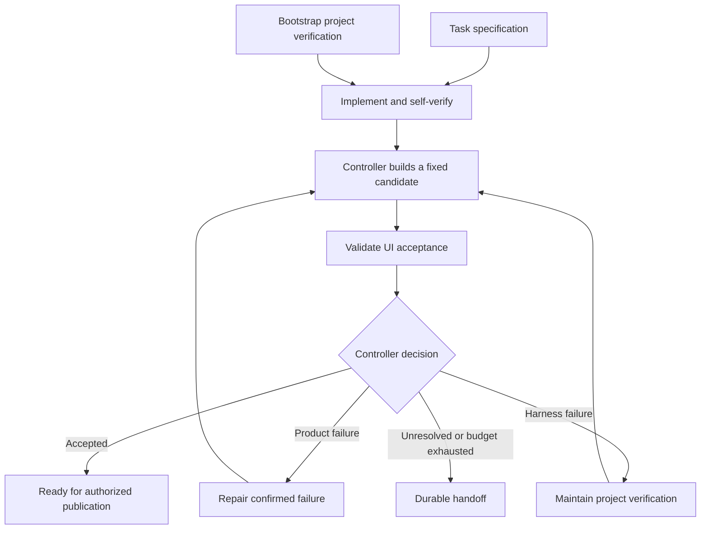

# Agent workflows: our pstack adaptation

A small skills library for one Codex implementer and one independent Grok browser validator, with a bounded repair loop. The planned runtime is GitHub Actions coordinating E2B sandboxes. A second validator can be added later without changing the acceptance principles.

This directory contains our adapted instructions, a shared runtime contract, provenance, and reading examples. It does not yet contain the cloud runner, browser adapter, production artifact store, or executable acceptance gate. No global skills or automations are installed by this repository.

## Start reading here

1. [Upstream comparison](UPSTREAM_COMPARISON.md): which pstack files we borrowed from, where their ideas landed, and what changed.
2. [Runtime contract](RUNTIME_CONTRACT.md): who owns what, what a task brief contains, how evidence and acceptance work, and what the runner will enforce.
3. [Bootstrap project verification](skills/bootstrap-project-verification/SKILL.md): turn an app into something an agent can reliably operate and inspect.
4. [Implement and self-verify](skills/implement-and-self-verify/SKILL.md): Codex's responsibilities before handing off a candidate.
5. [Validate UI acceptance](skills/validate-ui-acceptance/SKILL.md): Grok's independent browser evaluation.
6. [Repair confirmed failure](skills/repair-confirmed-failure/SKILL.md): the feedback path into implementation.
7. [Maintain project verification](skills/maintain-project-verification/SKILL.md): keep guides and browser tooling accurate without changing requirements.
8. [Improve agent workflow](skills/improve-agent-workflow/SKILL.md): evaluate skill/tool changes between runs.

For a concrete example, read the [notes acceptance specification](examples/notes-acceptance.json) and [scenario table](examples/acceptance-scenarios.md) after the validator skill. They are illustrative inputs and expected decisions, not live test results.

## How the pieces fit



The operating guide explains how to run and observe the app. The source-informed feature map helps implementers and maintainers. The acceptance specification defines required behavior. The validator's initial input excludes implementation reasoning and feature recipes so it can choose its own journeys.

Skills guide decisions; the runtime enforces identities, tool restrictions, evidence retention, budgets, and final acceptance. Keeping those responsibilities separate is the central adaptation.

## Repository layout

| Path | Purpose |
| --- | --- |
| `agent-workflows/skills/` | Our six active skill definitions |
| `agent-workflows/RUNTIME_CONTRACT.md` | Shared controller and reporting requirements |
| `agent-workflows/examples/` | Reading examples and future evaluation cases |
| `agent-workflows/UPSTREAM_COMPARISON.md` | Side-by-side file and behavior map |
| `agent-workflows/provenance.json` | Pinned upstream revision, source files, hashes, and destination mappings |
| `agent-workflows/tools/check_library.py` | Local package/link/provenance checks; not a behavioral eval |
| `pstack/` | Unmodified upstream pstack at the pinned baseline, retained for comparison |

Pstack is a directory inside `cursor/plugins`, so the GitHub fork retains that repository's other plugins. Our workflow uses `agent-workflows/` only. Installing upstream pstack or its marketplace does not install these adaptations.

## Using and changing the library

Keep this directory intact because skill entrypoints link to the shared contract. For a future runner, mount the package read-only, pin its commit, and explicitly supply the phase's skill and contract. For a standalone skill installation, first vendor the linked resources into that skill and update references; copying only one directory is incomplete.

The skills use portable name/description frontmatter. They retain normal discovery for interactive use, while the controller will explicitly select mandatory workflow stages. Model names, credentials, browser tool names, and sandbox settings belong in runtime configuration rather than the instructions.

Edit the owning skill for decision guidance and the runtime contract for controller behavior. Keep their responsibilities aligned. Test meaningful changes against a known-good app and deliberately broken variants before promoting them. Record a new skill version; do not mutate active runs.

## Checks and current validation status

From the repository root:

```bash
python3 agent-workflows/tools/check_library.py
```

The checker verifies the six entrypoints, local Markdown links, source/destination mappings, pinned source content hashes, and example criterion IDs. The Codex skill-authoring validator was also run on each new skill. These static checks do not prove model behavior, browser execution, E2B compatibility, or real defect detection. Those are the next integration/evaluation milestone.

The first live pilot should bootstrap one private web app, run one successful task end to end, and demonstrate that the validator catches intentionally broken persistence and cross-user isolation. Measure misses, false failures, unresolved runs, elapsed time, and cost before adding more models.

## Attribution

Adapted from Lauren Tan's pstack in [cursor/plugins](https://github.com/cursor/plugins/tree/93b00b89ef425a9c1bac0d0b317dfc49c930ac99/pstack), pinned at `93b00b89ef425a9c1bac0d0b317dfc49c930ac99`. See [LICENSE](LICENSE) and [provenance](provenance.json). The original pstack directory is preserved without modification.
