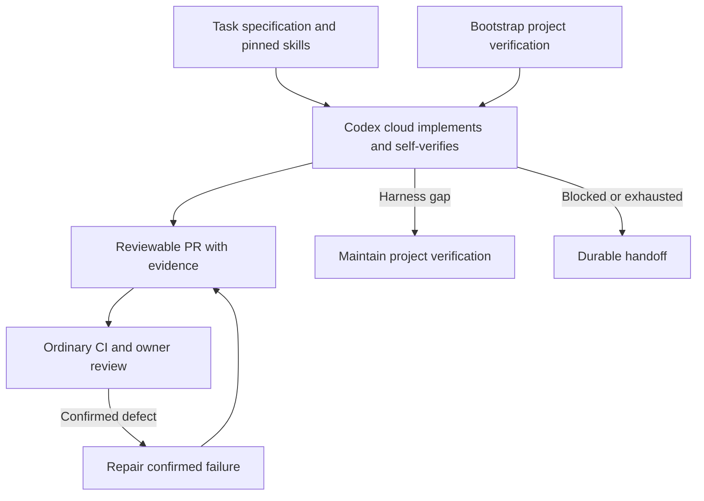

# Agent workflows: our pstack adaptation

A small skills library for managed Codex cloud agents to implement web-app changes, run automated tests, and validate the changed behavior through a browser. **V1 uses Codex self-validation, ordinary CI, and owner review.** An independent Grok validator, E2B, and custom orchestration are deferred until observed gaps justify them.

This directory contains our adapted instructions, a shared runtime contract, provenance, and reading examples. It does not yet contain the cloud runner, browser adapter, production artifact store, or executable acceptance gate. No global skills or automations are installed by this repository.

## Start reading here

For the full architecture discussion and staged rollout, read the [implementation plan](IMPLEMENTATION_PLAN.md). To adopt it in a future project, use the [copyable project handoff](PROJECT_HANDOFF.md).

1. [Upstream comparison](UPSTREAM_COMPARISON.md): which pstack files we borrowed from, where their ideas landed, and what changed.
2. [Runtime contract](RUNTIME_CONTRACT.md): read the short v1 scope first; the remaining sections describe the deferred independent runner.
3. [Bootstrap project verification](skills/bootstrap-project-verification/SKILL.md): turn an app into something an agent can reliably operate and inspect.
4. [Implement and self-verify](skills/implement-and-self-verify/SKILL.md): Codex's responsibilities before handing off a candidate.
5. [Validate UI acceptance](skills/validate-ui-acceptance/SKILL.md): deferred Grok independent browser evaluation; optional reading for v1.
6. [Repair confirmed failure](skills/repair-confirmed-failure/SKILL.md): the feedback path into implementation.
7. [Maintain project verification](skills/maintain-project-verification/SKILL.md): keep guides and browser tooling accurate without changing requirements.
8. [Improve agent workflow](skills/improve-agent-workflow/SKILL.md): evaluate skill/tool changes between runs.

For a concrete example, read the [notes acceptance specification](examples/notes-acceptance.json) and [scenario table](examples/acceptance-scenarios.md) after the validator skill. They are illustrative inputs and expected decisions, not live test results.

## How the pieces fit



The operating guide explains how to run and observe the app. The source-informed feature map helps implementers and maintainers. The acceptance specification defines required behavior. The validator's initial input excludes implementation reasoning and feature recipes so it can choose its own journeys.

Skills guide decisions. In v1, the available platform/CI supplies executable checks and the owner reviews the result; skills do not create a hard gate. The deferred runtime contract describes stronger identity, tool, evidence, and budget enforcement for independent validation.

## Repository layout

| Path | Purpose |
| --- | --- |
| `agent-workflows/IMPLEMENTATION_PLAN.md` | Durable architecture, recommended milestones, decisions, and open choices |
| `agent-workflows/PROJECT_HANDOFF.md` | Copyable prompt and project record for resuming around a real repository |
| `agent-workflows/skills/` | Our six skill definitions; independent acceptance is deferred |
| `agent-workflows/RUNTIME_CONTRACT.md` | V1 scope and deferred controller/reporting requirements |
| `agent-workflows/examples/` | Reading examples and future evaluation cases |
| `agent-workflows/UPSTREAM_COMPARISON.md` | Side-by-side file and behavior map |
| `agent-workflows/provenance.json` | Pinned upstream revision, source files, hashes, and destination mappings |
| `agent-workflows/tools/check_library.py` | Local package/link/provenance checks; not a behavioral eval |
| `pstack/` | Unmodified upstream pstack at the pinned baseline, retained for comparison |

Pstack is a directory inside `cursor/plugins`, so the GitHub fork retains that repository's other plugins. Our workflow uses `agent-workflows/` only. Installing upstream pstack or its marketplace does not install these adaptations.

## Using and changing the library

Keep this directory intact because skill entrypoints link to the shared contract. For v1, make the pinned package available in the actual cloud checkout/setup and explicitly supply the relevant skill and v1 scope in the task brief. Verify loading; a local desktop installation does not install it in cloud. A future independent runner should mount the pinned package read-only. For a standalone skill installation, first vendor linked resources and update references; copying only one directory is incomplete.

The skills use portable name/description frontmatter. They retain normal discovery for interactive use, while the controller will explicitly select mandatory workflow stages. Model names, credentials, browser tool names, and sandbox settings belong in runtime configuration rather than the instructions.

Edit the owning skill for decision guidance and the runtime contract for controller behavior. Keep their responsibilities aligned. Test meaningful changes against a known-good app and deliberately broken variants before promoting them. Record a new skill version; do not mutate active runs.

## Checks and current validation status

From the repository root:

```bash
python3 agent-workflows/tools/check_library.py
```

The checker verifies the six entrypoints, local Markdown links, source/destination mappings, pinned source content hashes, and example criterion IDs. The Codex skill-authoring validator was also run on each new skill. These static checks do not prove model behavior, browser execution, E2B compatibility, or real defect detection. Those are the next integration/evaluation milestone.

Start with a real web app developed interactively and an exercised verification package. The first cloud pilot should use managed Codex with our skills to implement and browser-test a real feature, retain evidence, and hand off for CI and owner review. Measure human time per accepted feature, missed defects, false failures, incomplete runs, elapsed time, and usage/cost before deciding whether to pilot an external validator. See the [implementation milestones](IMPLEMENTATION_PLAN.md#implementation-milestones).

## Attribution

Adapted from Lauren Tan's pstack in [cursor/plugins](https://github.com/cursor/plugins/tree/93b00b89ef425a9c1bac0d0b317dfc49c930ac99/pstack), pinned at `93b00b89ef425a9c1bac0d0b317dfc49c930ac99`. See [LICENSE](LICENSE) and [provenance](provenance.json). The original pstack directory is preserved without modification.
